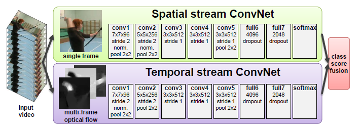

# Two-Stream Reproduce Blog

Authors:

Chen Sun (5262763)

Jinyun Long (5352177)

[Link to code](https://github.com/sccc-8/two-stream-action-recognition).

## Introduction

The video recognition research is mostly inspired by the advances in image recognition methods, and a large amount of video action recognition methods are based on high-dimensional encodings of local spatio-temporal features as presented in Histogram of Oriented Gradients (HOG) and Histogram of Optical Flow (HOF).

This paper proposes a new two-stream architecture to cope with the challenge of action recognition in video data. This architecture shows a competitive performance in video classification tasks, and it also offers a potential research direction in this field that training a temporal stream network on optical flow is a feasible and good method to deal with these tasks.

This blog aims to describe our attempt to reproduce certain aspects of the paper ‘Two-Stream Convolutional Networks for Action Recognition in Videos’ by Karen Simonyan and Andrew Zisserman [1]. We chose to reproduce the results obtained by this paper and extend work by using different data augmentation methods to realize the effect of the processed dataset. Besides, we attempted to perform a hyperparameter to see how the learning rate and batch size influence the performance of the network.

## Two-Stream Architecture

Due to the fact that deep Convolutional Networks (ConvNets) performs well on image classification tasks, Karen Simonyan [1] aimed to use this type of neural network to achieve action recognition in video data. However, if we still choose to use consecutive stacked video frames as input to the network intuitively, it is hard to get a good result. The reason is that in this case, the network needs to learn spatio-temporal motion-dependent features implicitly, which may not be feasible for a certain network. Therefore, a new architecture was proposed to get higher performance in action recognition tasks in videos, which is called two-stream networks. 

Generally, this network consists of two separate recognition streams (spatial and temporal), which are then combined by late fusion. This idea is based on the assumption that videos can be decomposed into spatial and temporal parts. The spatial part is in the form of individual frames of the video, which contains the information about scenes and objects. The temporal part is in the form of motion across multiple frames, which shows the movement of the observer and the objects. Accordingly, the spatial stream of the model can recognize actions from still video frames, since some actions are strongly related with certain objects. The temporal stream is able to perform action recognition in the form of dense optical flow. The input of the temporal stream can be seen as a set of displacement vector fields between several consecutive frames. It can display the motion between video frames explicitly, which makes the recognition task easier than previous methods.

## Dataset: UCF101

### Original Dataset

Our architecture for spatial and temporal networks is trained and tested on UCF-101, a challenging dataset of actions. It is an action recognition data set of realistic action videos of people, which has 101 kinds of different action classes, over 13 thousand clips and 27 hours of video data. It is extended from UCF-50. 
UCF-101 includes action classes of 5 types: human-object interaction, body-motion only, human-human interaction, playing musical instruments, and sports. Each action class consists of 25 groups with 4 to 7 motion clips. All video clips have fixed frame rate of 25 FPS and resolution of 320*240. 

### Preprocessed Dataset

We use the preprocessed data of UCF-101 as input data for spatial network and temporal network from [here](https://github.com/feichtenhofer/twostreamfusion ) concerning the intensive computation to process this large volume of dataset ourselves (over 60 GB in total).

For spatial input data, RGB frames are extracted from each video with a sampling rate of 10 and save them as .jpg images. The picture below shows the RGB frames from clip 01 of group 01 of “ApplyEyeMakeup” action class.

For motion input data, 2-channel optical flow images are generated through [Flownet2.0](https://github.com/lmb-freiburg/flownet2-docker)  and the x and y channels are saved as .jpg images. To compute optical flow, multiple FlowNets are used in the complete architecture to compute the optical flow of two input images. Brightness Error is the difference between the first image and the second image computed with previously estimated flow.

The picture below presents 9 consecutive  preprocessed optical flow image from clip 01 of group 01 of “ApplyEyeMakeup” action class. The bright contour in the figure indicates the moving hands in the video.

## Original Code

Since the code of this paper is not available, and this type of deep ConvNet is very difficult for us to build and train on our own without enough guidance and computational resources (the original paper says that a single temporal Convnet takes 1 day for training on a system with 4 NVIDIA Titan cards). Finally, we chose to use the code provided by this [repository](https://github.com/jeffreyyihuang/two-stream-action-recognition), which is a two-stream architecture using spatial and motion stream CNN with Resnet101. However, the readme file of this repo does not provide any information about the environment it operates, we hardly ran the default code when we tried to transfer it to Google Colab. We also observed that most of those *.py* files in this repo are written in python 2, when we put it in a python 3 environment, many syntax errors occurred at once. Besides, we met some issues related to ‘dataloader’, the reason might be that the contributor of this repo preprocessed input data himself instead of using the provided data. Thus, we spent a lot of time debugging the provided code and building required environment. To directly save the modified code, we uploaded them into Google Drive and wrote a script to get them working in a Jupyter Notebook environment. Another problem we met is how to get access to those preprocessed datasets. It is time-consuming to download them to Google Colab due to the volume of the data. Also, how to unzip these data is also a big problem because the mechanism inside Google Drive is that it can not unzip as fast as our local laptop and sometimes it will lose connection automatically. To solve these issues, extra space of Google Drive was purchased to have enough space to save the zip file of dataset. However, we still need to copy the zip file to the root menu of Google Colab (‘/content’) and unzip them every time we implement our experiments.

*Spatial_cnn.py* defines the training process for the spatial CNN. ResNet of torch.utils.model_zoo is used for training both networks. Here ResNet-101, which is 101-layer deep, is pre-trained with ImageNet and then used for our RGB dataset. Firstly, the spatial data loader is prepared, which is defined in spatial_dataloader.py. Then the resnet-101 model is trained, with the output computed and loss evaluated in a mini-batch. The techniques in Temporal Segment network are used, and 3 frames are selected randomly from each video. Then the consensus of the frames is derived as prediction for calculating loss of that video level. In the architecture, Stochastic Gradient Descent (SGD) of torch.optim is used as the optimizer. Cross-entropy loss is used as the criterion to measure the performance of classification. ReduceLROnPlateau of torch.optim.lr_scheduler is used for dynamic learning rate reduction when a metric has stopped improving in the training.

Similarly, the training of motion CNN has a similar structure as the spatial CNN. In every mini-batch, 64 videos (batch size) are selected from 9537 training videos. one stacked optical flow in each video is also randomly selected.

The data augmentation and normalization for training is described in the dataloader of each network. Transformations such as random cropping, random flipping horizontally of images are used as data augmentation techniques. The normalization uses the mean and standard deviation of pre-trained ImageNet. 

## Experiments and Results

First of all, we used pretrained models (spatial and temporal) provided in the repo for validation. The original validation results given in the repo are shown as follow:

| Network        | Accuracy |
| -------------- | -------- |
| Spatial cnn    | 82.1%    |
| Motion cnn     | 79.4%    |
| Average Fusion | 88.5%    |

We could obtain similar results using their pretrained model. Then we attempted to further fine-tune the model on our spatial UCF101 dataset. The default batch size in this code is 25 with 5e-4 as initial learning rate. We continued to use this configuration to train 10 more epochs considering the extremely long training time. Similarly, we changed the batch size to 32 and set the initial learning rate to 0.01 and 0.0001 respectively. From the results, we can observe that further fine-tuning may not improve the performance of the model, which even gets worse. Meanwhile, when trying different hyperparameters, we also found that changing initial learning rate cannot affect the model although there is a discrepancy in the results. Because no matter how we change the initial learning rate, the learning rate during further training will be a constant, which is 5e-9. We suppose that this learning rate originates from the pretrained model, and though we changed the initial learning rate, it can not be optimized in this further training procedure.

Afterwards, we tried to implement different data augmentation methods to evaluate the performance of the network on different datasets. Still, we trained and validated for 10 more epochs after loading the pre-trained model. As we mentioned before, the initial transformations in the spatial stream network are random cropping, random flipping horizontally and normalization. We firstly added two more transformations which are center cropping and random vertical flipping respectively. Then, we substituted initial transformation with center crop, vertical flip and color jitter. Finally, we use center crop, horizontal flip and color jitter as transformations. The results demonstrate that the performance degrades when adding center crop and vertical flip. However, if we directly use center crop and vertical flip with color jitter instead of random crop and horizontal flip, we can get a better and robust model.

| Method                                                       | Accuracy |
| ------------------------------------------------------------ | -------- |
| Spatial Stream ConvNet [1]                                   | 73.0%    |
| Spatial Stream (pretrained model)                            | 81.2%    |
| pretrained + further training (batch_size=25, lr=5e-4)       | 80.4%    |
| pretrained + further training (batch_size=32, lr=0.01)       | 79.1%    |
| pretrained + further training (batch_size=32, lr=1e-4)       | 78.5%    |
| pretrained + CenterCrop + VerticalFlip                       | 80.0%    |
| pretrained + CenterCrop + VerticalFlip + ColorJitter(br=0.5, contract=0.5) | 81.9%    |
| pretrained + CenterCrop + HorizontalFlip + ColorJitter(br=0.5, contract=0.5) | 81.9%    |

To evaluate the sensitivity to hyperparameters, it is hard to make some conclusions when fine-tuning after loading pre-trained model. Thus, we chose to train the model at the very beginning. We set the batch size to 32 with learning rate at 1e-4 and 2e-4 respectively, and we trained the model for 15 epochs. Still, we tried to increase the batch size to 64, however, due to the memory limitation of Google Colab GPU, we can not implement it at all. From the figure below, it is obvious that lower learning rate has better performance. Thus, we can conclude that the initial learning rate may influence the quality of the model to some extent.

For the temporal stream, we loaded pre-trained model and fine-tuning it on our optical flow dataset for 30 epochs. The default batch size is 64 and learning rate is 1e-2, we changed them to 32 and 1e-4 respectively to see the impact. In this case, the same issue occurs when fine-tuning spatial network, the learning rate keeps being constant no matter how we change the initial learning rate. Therefore, the results present that larger batch size can improve the performance of the model. Also, we tried to figure out the influence of implementing data augmentation on optical flow dataset. The result of it is foreseen because the information in stacked optical flow dataset is not that comprehensible as still images, when extra transformations are implemented, some features may be difficult to learn. We planned to evaluate hyperparameters in temporal stream network at the beginning, however, the training of this type of network is a difficult job which needs much computational resources and time to achieve. We can not make any conclusions if we just train it for tens of epochs.

| Method                                                 | Accuracy |
| ------------------------------------------------------ | -------- |
| Temporal Stream ConvNet [1]                            | 83.7%    |
| Temporal Stream (pretrained model)                     | 79.6%    |
| pretrained + further training (batch_size=64, lr=1e-2) | 79.9%    |
| pretrained + further training (batch_size=32, lr=1e-4) | 79.2%    |
| pretrained + RandomCrop + HorizontalFlip               | 76.3%    |

This code uses averaging fusion to combine two stream networks. And we achieve competitive results compared with the paper.

| Method                                     | Accuracy |
| ------------------------------------------ | -------- |
| Two-stream model (fusion by averaging) [1] | 86.9%    |
| Two-stream model (pretrained)              | 88.3%    |

In the validation process of the default spatial stream network, we observe that when there are more epochs tested, the loss of each epoch is fluctuating from 2.6 to 3.3. This also appears when we change the methods and hyperparameters of training. This phenomenon is strange and it could be a point we need to figure out in further experiments.

## Conclusion

In our experiments, we first work on the default spatial network and temporal network to observe the performance of the two stream networks. The results show that the accuracy of the pre-trained model has competitive results compared with the paper. Our spatial network outperforms the model in the paper, whilst our temporal network has a bit lower accuracy. For spatial CNN, we change the batch size and learning rate to evaluate hyperparameters. We also try different data augmentation methods, like changing random cropping to center cropping and random vertical flipping, to observe the performance of the networks. In addition to using pre-trained models of 30 epochs, we also run the training process from epoch 0 at the beginning and find out the relationship of learning rate and corresponding performance. For temporal network, we again modify its hyperparameters and transformation to see the accuracy of training. Finally, an average fusion method is used to combine the two stream networks, it is consistent with the conclusion in the paper that temporal and spatial recognition streams are complementary, as their fusion significantly improves on both [1].

## Discussion

The reproducibility of this paper is doubtful because the code of the original paper is not available for us, and the complexity in terms of computational resources and knowledge to reproduce the same network in the paper also impeded a complete reproduction. Also, since the model we used in this project is based on Resnet instead of ConvNet, the results may not prove the correctness of the paper. However, we suppose that this issue might be overcomed by expert peers. Generally speaking, the idea proposed in the paper is a novel and feasible method to deal with action recognition tasks in video data. More research can be exploited in this field.

## References

[1] [Simonyan, K., Zisserman, A.: Two-Stream Convolutional Networks for Action Recognition in Videos. In: Neural Information Processing Systems (NIPS) (2014)](https://arxiv.org/pdf/1406.2199.pdf)

[2] [https://github.com/jeffreyyihuang/two-stream-action-recognition](https://github.com/jeffreyyihuang/two-stream-action-recognition)
